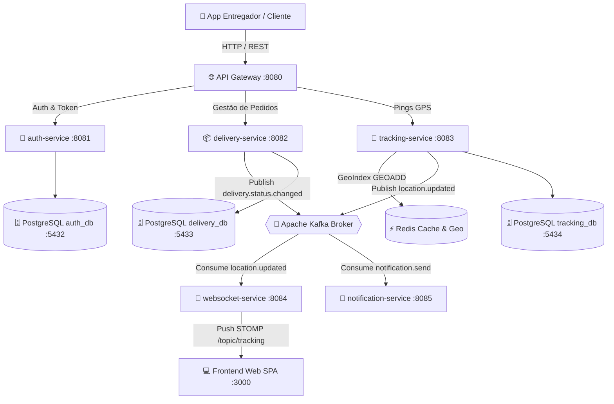

# Rastreamento de Entregas em Tempo Real

Plataforma enterprise de rastreamento logístico em tempo real com arquitetura de microsserviços orientada a eventos (Event-Driven Architecture), ingestão de telemetria GPS de alta vazão, indexação geoespacial no Redis Geo, push via WebSockets STOMP e visualização interativa em mapa Leaflet/OpenStreetMap.

---

## 📐 Arquitetura do Sistema



---

## 🛠️ Stack Tecnológica

| Camada | Tecnologia |
|--------|------------|
| **Linguagem Backend** | Java 21 (OpenJDK / Temurin) |
| **Framework Backend** | Spring Boot 3.3 / Spring Cloud Gateway |
| **Frontend Web** | Next.js 14, React 18, TypeScript, Leaflet + OpenStreetMap |
| **Event Streaming** | Apache Kafka 7.6 + ZooKeeper (12 partições para GPS) |
| **Banco de Dados** | PostgreSQL 16 (3 instâncias isoladas: `auth_db`, `delivery_db`, `tracking_db`) |
| **Cache & Geo Indexing** | Redis 7 (`GEOADD`, `GEORADIUS`, Token Blacklist) |
| **WebSockets** | STOMP sobre WebSocket (Spring Messaging) |
| **Observabilidade** | OpenTelemetry Collector, Prometheus 2.51, Grafana 10.4, Loki, Promtail |
| **DevOps & Containers** | Docker Compose v2 |

---

## 🚀 Serviços e Portas

| Serviço | Porta | Descrição |
|---------|-------|-----------|
| `api-gateway` | 8080 | Gateway de Roteamento Spring Cloud Gateway |
| `auth-service` | 8081 | Autenticação IAM, JWT RS256 e Refresh Token |
| `delivery-service` | 8082 | Gestão de entregas, pacotes e status de pedidos |
| `tracking-service` | 8083 | Ingestão de coordenadas GPS e Redis Geo |
| `websocket-service` | 8084 | Servidor WebSocket STOMP para push de localização ao vivo |
| `notification-service` | 8085 | Processador de notificações SMS / Email / Push |
| `frontend-web` | 3000 | Interface Web SPA com Mapa Leaflet |
| `PostgreSQL (auth)` | 5432 | Banco relacional de autenticação |
| `PostgreSQL (delivery)` | 5433 | Banco relacional de entregas |
| `PostgreSQL (tracking)` | 5434 | Banco relacional de histórico GPS |
| `Redis` | 6379 | Cache e índice espacial |
| `Kafka` | 9092 / 29092 | Event broker |
| `Prometheus` | 9090 | Métricas de observabilidade |
| `Grafana` | 3000 (infra) | Dashboards visuais |

---

## ⚡ Início Rápido (5 minutos)

### 1. Clonar e subir a infraestrutura Docker

```bash
git clone https://github.com/RafaelReis22/-Rastreamento-de-Entregas-em-Tempo-Real.git
cd -Rastreamento-de-Entregas-em-Tempo-Real

# Subir bancos PostgreSQL, Redis, Kafka, OTel e Grafana
docker compose up -d
```

Aguarde até que os serviços fiquem saudáveis (`docker compose ps`).

### 2. Compilar os Microsserviços Backend

```bash
cd backend
mvn clean package -DskipTests
```

### 3. Executar os Microsserviços

Em terminais separados:
```bash
cd backend/auth-service && java -jar target/*.jar
cd backend/delivery-service && java -jar target/*.jar
cd backend/tracking-service && java -jar target/*.jar
cd backend/websocket-service && java -jar target/*.jar
cd backend/api-gateway && java -jar target/*.jar
```

### 4. Executar o Frontend Web Next.js

```bash
cd frontend-web
npm install
npm run dev
```

Acesse o painel em: **http://localhost:3000**

### 5. Executar o Simulador de Pings GPS

Para simular um entregador em trânsito pela Av. Paulista e ver o marcador se movendo no mapa:

```bash
node infra/scripts/gps-simulator.js
```

---

## 🛰️ Tópicos Kafka e Eventos

| Tópico Kafka | Partições | Descrição |
|--------------|-----------|-----------|
| `location.updated` | 12 | Pings de telemetria GPS do entregador |
| `delivery.status.changed` | 6 | Mudanças de estado da entrega (`PENDING` -> `IN_TRANSIT` -> `DELIVERED`) |
| `notification.send` | 6 | Eventos disparadores de notificação ao cliente |
| `location.updated.DLT` | 3 | Dead Letter Queue para falhas de processamento GPS |

---

## 📄 Licença

MIT License — consulte o arquivo `LICENSE` para mais detalhes.